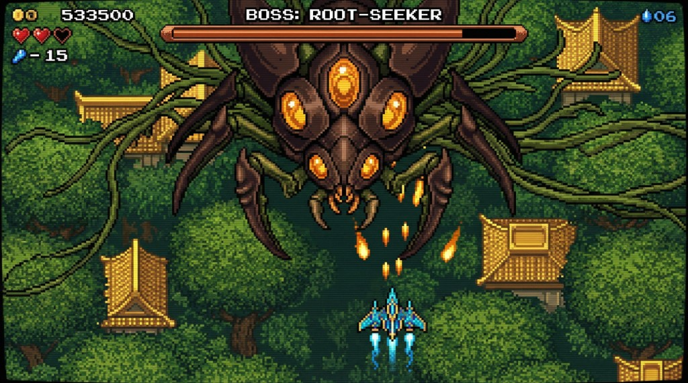
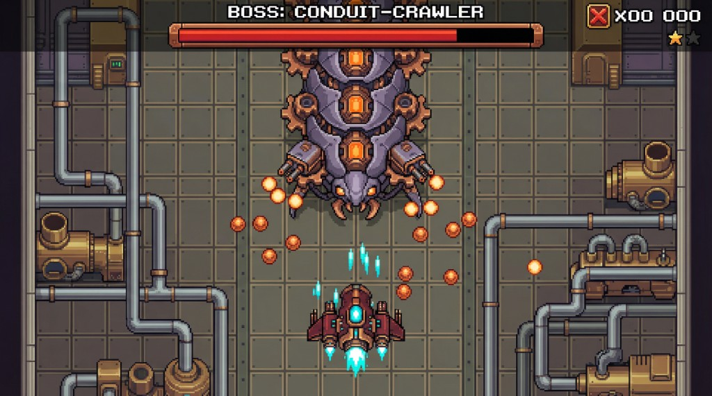

# Boss Mocks — P0.4 Deliverable (CEO Review)

**Phase 0 · Investor Pitch · 2025-03-02 · LOCKED IN (CEO approved)**

Two boss fight mocks for investor pitch. **Both mocks LOCKED IN.** **Style reference:** Level mocks (forest, industrial), sophisticated_ref_1, 5, 7. **Strict top-down overhead view.** Bosses per [boss_encounter_briefs.md](boss_encounter_briefs.md). Player ships and environments per [player_ship_sparrow_poc.md](../p0_1_ships/sparrow/player_ship_sparrow_poc.md), [enemy_hierarchy_and_ship_notes.md](enemy_hierarchy_and_ship_notes.md), [level_mocks_deliverable.md](../p0_3_levels/level_mocks_deliverable.md).

---

## Gate

CEO reviews and approves. If rejected, revise and resubmit.

---

## Mock 1: Level 1 Boss (Root-Seeker) + Sparrow + Forest

**Status: LOCKED IN (CEO approved)**

**Design intent:** Establish the forest-organic boss read. Root-Seeker (Hive Anchor) as a massive insectoid creature emerged from or resting on the canopy—horizontal sprawl, 6–8 appendages (leg-like, mandible-like, vine-like tendrils), dark brown carapace, amber/orange glowing cores at joints and center. **Sparrow in front of boss**—player ship in foreground, boss in background. **Sparrow matches** [sparrow_ship_kaladesh.png](../p0_1_ships/sparrow/sparrow_ship_kaladesh.png) (cyan/cobalt, gold filigree, aether blue core). **Boss UI** at top: "BOSS: ROOT-SEEKER", copper-framed health bar, score/lives. Forest canopy—varied greens, tree crown tops, gilded temple tops. **Strict top-down view.** Combat energy: amber beams, spread projectiles, orb hints. "Ancient predator rooted in the forest." **Style:** 16-bit game aesthetic, match locked-in level mocks.

  
*Sparrow small in foreground, Root-Seeker boss dominates. Same ship proportion as Conduit-Crawler mock. Forest canopy environment. Amber cores, vine/root tendrils, organic-mechanical fusion.*

---

## Mock 2: Level 2 Boss (Conduit-Crawler) + Dragon + Industrial

**Status: LOCKED IN (CEO approved)**

**Design intent:** Establish the industrial-mechanical boss read. Conduit-Crawler (Pipe Leviathan) as a vertical, tower-like machine-beast—piston arms, pipe-tendrils, rotating turret mounts, purple-grey carapace, copper/bronze accents, orange cores. **Dragon matches** [dragon_ship_kaladesh_v3.png](../p0_1_ships/dragon/dragon_ship_kaladesh_v3.png) (dark red, multiple gun mounts, copper/bronze, cyan energy). **Boss UI** at top: "BOSS: CONDUIT-CRAWLER", copper-framed health bar, score/lives. Industrial background—grey pipes, conduits, copper, brass, machinery from above. **Strict top-down view.** Combat energy: turret volleys, conduit beams, copper-colored orbs. "Industrial parasite—half creature, half machine." **Style:** 16-bit game aesthetic, match locked-in level mocks.

  
*Conduit-Crawler boss towering over play area, Dragon silhouette engaged, industrial pipes and conduits environment. Turret mounts, copper plating, steam/energy vents.*

---

## Asset List

| Asset | Format | Size | Notes |
|-------|--------|------|-------|
| boss_mock_1_forest.png | PNG | 2560×1440 | Level 1 Root-Seeker + Sparrow + Forest concept mock |
| boss_mock_2_industrial.png | PNG | 2560×1440 | Level 2 Conduit-Crawler + Dragon + Industrial concept mock |
| boss_mock_2_industrial_alt.png | PNG | — | Conduit-Crawler alternate (CEO approved) |

---

## Gate

CEO approved. Both mocks locked in.
